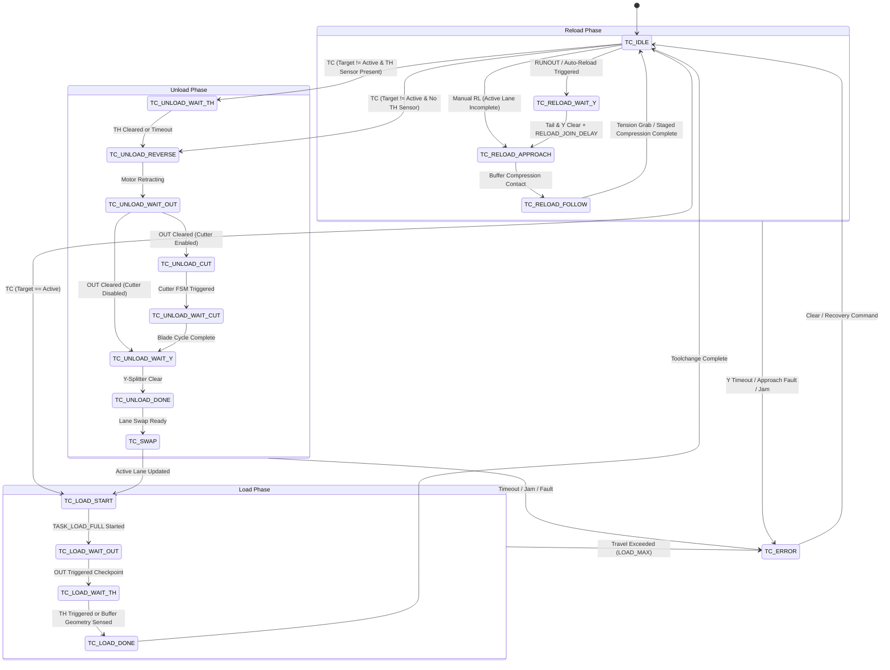
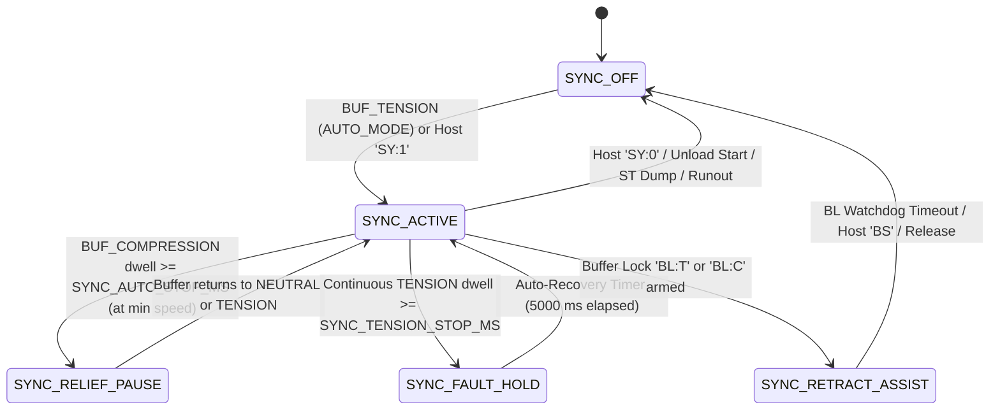

# FLARE Architecture

**Analysis Date:** 2026-09-11

FLARE ("Filament Lane Automation and Reload Engine") is a bare-metal embedded firmware and host tooling system designed for 2-lane 3D-printer filament multiplexing, toolchanging, and autonomous spool runout reloading. The firmware runs on the Raspberry Pi RP2040 microcontroller (specifically targeting the FYSETC ERB v2.0 board), driving stepper motors via Trinamic TMC2209 drivers over UART and step/dir PWM, reading optomechanical filament sensors and spring-trolley buffer sensors, and controlling a blade cutter servo.

---

## 1. System Topology & Tiering

The FLARE system consists of three architectural tiers co-located on a single 3D printer:

```
+-------------------------------------------------------------------------+
|                              KLIPPER TIER                               |
|   klipper/mmu.py (Happy-Hare API mock), klipper/mmu_sensors.py          |
|   G-code macros, Moonraker web UI (Mainsail / Fluidd)                   |
+-------------------------------------------------------------------------+
                                    │ HTTP / Moonraker / G-code
                                    ▼
+-------------------------------------------------------------------------+
|                               HOST DAEMON                               |
|   scripts/flare_daemon.py (Python multi-threaded daemon)                |
|   - HTTP REST API & 20 Hz SSE Telemetry (/status, /telemetry, /cmd)     |
|   - Moonraker / Spoolman proxy & consumption logging                    |
|   - SQLite local database (<data_dir>/flare.db)                         |
|   - Serial manager (pyserial USB CDC at 115200 baud, serialized lock)   |
+-------------------------------------------------------------------------+
                                    │ USB CDC Serial (Line Protocol)
                                    ▼
+-------------------------------------------------------------------------+
|                            RP2040 FIRMWARE                              |
|   firmware/src/main.c (Bare-metal cooperative superloop, no RTOS)       |
|   Subsystems: Motion, Sync Control, Toolchange/RELOAD, Protocol, Store  |
+-------------------------------------------------------------------------+
       │                     │                     │                │
       ▼                     ▼                     ▼                ▼
+-------------+      +---------------+      +-------------+   +-----------+
| 2x TMC2209  |      | Optical / Dyn |      | Dual Endstop|   | Cut Servo |
| Step/Dir+PWM|      | IN/OUT/Y Sens |      | / Analog Hall|  | PWM Pulse |
+-------------+      +---------------+      +-------------+   +-----------+
```

### Standalone Local Safety Design
A core architectural premise is that **safety and autonomy reside entirely on-device**:
- The RP2040 firmware executes all critical motion, buffer synchronization, cutting, and reload transitions locally.
- If the host USB link drops or the daemon crashes, the firmware continues printing, synchronizing, or completing an active reload without halting or grinding filament (`README.md`).
- Klipper UI integration (`klipper/mmu.py`) is structured as a compatibility facade mimicking Happy-Hare interfaces; mock pause handlers exist in Klipper, but physical safety interlocks are enforced in firmware.

---

## 2. Firmware Execution Model: Cooperative Superloop

The firmware deliberately eschews real-time operating systems (FreeRTOS, Zephyr) in favor of a deterministic, single-threaded **cooperative superloop** in `firmware/src/main.c`.

### 2.1 The Superloop Tick Sequence
The main loop in `firmware/src/main.c:576-618` executes an explicit, strictly ordered sequence of non-blocking tick handlers. Every tick function receives the current millisecond timestamp (`g_now_ms = to_ms_since_boot(get_absolute_time())`), eliminating unsynchronized clock reads:

```c
while (true) {
    g_now_ms = to_ms_since_boot(get_absolute_time());
    watchdog_update();

    if (watchdog_reboot_detected && !watchdog_reboot_reported && g_now_ms >= 2000) {
        watchdog_reboot_reported = true;
        cmd_event("SYSTEM", "WATCHDOG_RESET");
    }

    if (!boot_stab_armed && g_active_lane != 0 && g_now_ms >= BOOT_STAB_FIRST_MS) {
        boot_stab_armed = true;
        boot_stabilize_start(g_now_ms);
    }

    // 1. Digital & Analog Inputs Sampling
    debounced_input_update(&g_lane_l1.in_sw);
    debounced_input_update(&g_lane_l1.out_sw);
    debounced_input_update(&g_lane_l2.in_sw);
    debounced_input_update(&g_lane_l2.out_sw);
    debounced_input_update(&g_y_split);
    debounced_input_update(&g_buf_tension_din);
    debounced_input_update(&g_buf_compression_din);

    // 2. Host Communication Processing
    cmd_poll(g_now_ms);

    // 3. Background Buffer Neutralization
    buffer_stabilize_tick(g_now_ms);

    // 4. Subsystem State Machines (Execution order is strictly load-bearing)
    cutter_tick(g_now_ms);
    tc_tick(g_now_ms);
    autopreload_tick(g_now_ms);
    lane_tick(&g_lane_l1, g_now_ms);
    lane_tick(&g_lane_l2, g_now_ms);
    buf_sensor_tick(g_now_ms);
    sync_tick(g_now_ms);

    // 5. Visual Diagnostics
    neopixel_tick(g_now_ms);

    sleep_us(MAIN_LOOP_SLEEP_US); // 200 us throttle
}
```

### 2.2 Why Tick Ordering is Load-Bearing
The sequence is carefully constrained by shared state dependencies across modules:
1. **Sensor debounce before `cmd_poll` and state machines**: Debounced switch states must reflect stable GPIO signals before any higher-level decisions occur.
2. **`cutter_tick` before `tc_tick`**: Toolchange phases (e.g. `TC_UNLOAD_WAIT_CUT`) poll `cutter_busy()`. Cutter state transitions must resolve before toolchange evaluates progression.
3. **`tc_tick` before `lane_tick`**: Toolchange initiates lane tasks (e.g., `TASK_LOAD_FULL`, `TASK_UNLOAD`, `TASK_FEED`). `lane_tick` must run in the same iteration to process distance integration and rate ramping immediately.
4. **`lane_tick` before `buf_sensor_tick` & `sync_tick`**: Motor step counts and speeds update during `lane_tick`. `buf_sensor_tick` and `sync_tick` need current motor velocities (`mmu_sps`) to accurately calculate the velocity estimator (`extruder_est_sps = mmu_feed - arm_velocity`).
5. **`buf_sensor_tick` before `sync_tick`**: `buf_sensor_tick` publishes `g_buf_signal` (normalizing analog Hall values or dual-endstop switch states into normalized -1.0..+1.0 positions). `sync_tick` reads `g_buf_signal` to evaluate control laws and reserve error.

### 2.3 Hardware Watchdog & Safety Budgets
- **Hardware Watchdog**: Configured at `main.c:575` for 1000 ms (`watchdog_enable(1000, true)`).
- **Watchdog Servicing**: Refreshed strictly at the head of each superloop pass via `watchdog_update()`.
- **Crash Diagnostics**: On boot, `watchdog_caused_reboot()` detects hardware watchdog timeouts. If triggered, `main.c` emits `EV:SYSTEM:WATCHDOG_RESET` after 2000 ms of stable uptime.
- **Loop Timing**: Throttled by `sleep_us(MAIN_LOOP_SLEEP_US)` (200 µs), giving typical loop cycle frequencies between 500 Hz and 2 kHz depending on serial payload volume.

---

## 3. Subsystem Architecture

The firmware is divided into clean modular subsystems defined under `firmware/src/` and `firmware/include/`.

```
                  +-----------------------------------+
                  |             main.c                |
                  | Superloop & Boot Initialization   |
                  +-----------------------------------+
                     │       │         │           │
     ┌───────────────┘       │         │           └────────────────┐
     ▼                       ▼         ▼                            ▼
+──────────────+     +──────────+   +─────────────+        +────────────────+
|   motion.c   |     | cutter.c |   |toolchange.c |        |   protocol.c   |
| Stepper PWM  |     | Servo    |   | Toolchange &|        | CDC Line Parser|
| Tasks & Ramp |     | Blade Seq|   | RELOAD FSM  |        | Status & TMC   |
+──────────────+     +──────────+   +─────────────+        +────────────────+
     ▲                                     ▲                        │
     │                ┌────────────────────┘                        │
     ▼                ▼                                             ▼
+───────────────────────────────────────────────────+      +────────────────+
|                   sync.c                          |      |settings_store.c|
| Central Sync State, Flow Schedules, Auto-Toggle   |      | Flash Sector   |
+───────────────────────────────────────────────────+      | Persist & CRC  |
     │                         │                   │       +────────────────+
     ▼                         ▼                   ▼
+---------------+     +-----------------+     +-----------------+
|  sync_buf.c   |     |  sync_relay.c   |     |  sync_analog.c  |
| Virtual Pos   |     | Type-D Relay    |     | Type-P Hall Law |
| Drift & Stab  |     | AIMD Floor Trim |     | Slew / Dist EMA |
+---------------+     +-----------------+     +-----------------+
```

### 3.1 Motion Engine (`firmware/src/motion.c`, `firmware/include/motion.h`)

The motion subsystem controls the physical steppers and tracks filament position per lane.

- **Data Structure (`lane_t`)**: Holds pins, hardware PWM slice/channel, debounced IN/OUT switches, active task, acceleration ramp state, distance accumulators, and fault flags.
- **Lane Tasks (`task_t`)**:
  - `TASK_IDLE`: Motor de-energized or held at zero velocity.
  - `TASK_AUTOLOAD`: Drives filament forward to OUT switch, then retracts `RETRACT_MM` to park in pre-loaded state.
  - `TASK_FEED`: Continuous forward feed for extruder synchronization or RELOAD follow.
  - `TASK_UNLOAD`: Retracts filament clear of OUT or IN sensors.
  - `TASK_LOAD_FULL`: Feeds filament from pre-load position past OUT to toolhead.
  - `TASK_MOVE`: Open-loop bounded move for positioning or buffer locking.
- **Acceleration Ramp**: Stepper PWM frequencies cannot step discontinuously. `lane_tick` ramps `current_sps` toward `target_sps` by `g_ramp_step_sps` every `g_ramp_tick_ms` (typically 17 mm/min every 5 ms).
- **Distance-Based Safety Guarantees**:
  - Distance integration: Travel distance `task_dist_mm` is accumulated every tick: `dist = current_sps / sps_per_mm * dt`.
  - Hard travel limits: Tasks are bounded by distance (`g_load_max_mm`, `g_unload_max_mm`, `g_autoload_max_mm`), not wall-clock time. If a sensor fails, the motor halts after exceeding the distance budget, preventing stripped filament.
- **Safety Watchdogs**:
  - **Dry Spin Guard**: If a motor is moving (`task != TASK_IDLE`), IN is empty (`!lane_in_present`), and the buffer is not in tension, spinning for > 8000 ms trips `FAULT_DRY_SPIN`.
  - **Tail in Transit Tracking**: When IN sensor drops, `dist_at_in_clear_mm` is latched. Filament between IN and OUT is recognized as "in transit" for `1.2 * DIST_IN_OUT` distance, suppressing spurious runout triggers.

### 3.2 Sync Control Subsystem (Split Units)

Filament feed rate during printing must match the 3D printer extruder rate exactly. The sync subsystem reads a spring-trolley buffer that expands (Tension) when the extruder pulls faster than the MMU feeds, and compresses (Compression) when the MMU feeds faster.

To maintain maintainability, sync is split into four cohesive units under `firmware/src/` sharing `firmware/include/sync_internal.h`:

#### 1. Central Coordinator (`firmware/src/sync.c`)
- Manages `g_sync_state` (`SYNC_OFF`, `SYNC_ACTIVE`, `SYNC_RETRACT_ASSIST`, `SYNC_RELIEF_PAUSE`, `SYNC_FAULT_HOLD`).
- **Sync Auto-Toggle**:
  - In `AUTO_MODE`, entering `BUF_TENSION` automatically starts sync.
  - Entering `BUF_COMPRESSION` at compression floor speed for `SYNC_AUTO_STOP_MS` transitions to `SYNC_RELIEF_PAUSE`.
  - Recovers to `SYNC_ACTIVE` as soon as the buffer drains to `NEUTRAL` or `TENSION`.
- **Flow Schedule Interpolation**: Evaluates `flow_param(flow_sps)` across piecewise-linear breakpoints in `g_flow_sched_runtime` to dynamically compute baseline speed and compression reserve cushion.
- **Transition Residual Drift Observer**: Computes mismatch between the virtual position model and physical switch triggers (`BPR = g_buf_pos - switch_pos`). Accumulates an EWMA drift correction (`g_bp_drift_ewma_mm`) to prevent long-term virtual model offset.

#### 2. Buffer Modeling & Service (`firmware/src/sync_buf.c`)
- **Virtual Position Integrator**: On Type-D dual-endstop hardware, continuous position is impossible to measure directly. `buf_virtual_position_tick()` integrates net filament displacement:
  $$\Delta x = (\text{mmu\_speed} - \text{extruder\_est}) \times \Delta t$$
  Virtual position `g_buf_pos` is bounded to `[-buf_half_travel, +buf_half_travel]`.
- **Switch Re-Anchoring**: When a switch transition occurs (e.g. `NEUTRAL -> TENSION`), `buf_anchor_virtual_position()` snaps `g_buf_pos` to the exact physical switch coordinate, resetting integration drift.
- **Velocity Estimator**: Dwell time between zone transitions is converted to arm velocity. Demand estimate:
  $$\text{demand} = \text{mmu\_feed} - \text{arm\_velocity}$$
  Blended into `g_extruder_est_sps` via an adaptive EMA bounded by `EST_ALPHA_MIN` and `EST_ALPHA_MAX`.
- **Buffer Stabilization (`BS:`)**: Background drive moving the buffer toward `NEUTRAL` at boot or after print completion.
- **Buffer Lock (`BL:<T|C>`) Engine**: Arms the buffer to a target extreme (Tension or Compression) for printer-side retraction assist.

#### 3. Type-D Hysteretic Relay Law (`firmware/src/sync_relay.c`)
Dual-endstop switches provide binary states (`BUF_TENSION`, `BUF_NEUTRAL`, `BUF_COMPRESSION`).
- `BUF_TENSION`: Commands aggressive catch-up feed:
  $$\text{target} = \text{baseline\_control\_floor\_sps}() \times \text{RELAY\_CATCHUP\_FRAC}$$
- `BUF_COMPRESSION`: Commands true zero feed (0 SPS) or a strictly bounded drain feed (`SYNC_COMPRESSION_DRAIN_FRAC`), halting before the motor can over-compress the buffer.
- `BUF_NEUTRAL`: Commands estimated extruder demand (`g_extruder_est_sps * RELAY_NEUTRAL_FRAC`) plus volatile crossing-learned trim `g_relay_neutral_trim_sps`.
- **Held Floor Latch with AIMD Probing**: On each tension touch, `g_tension_floor_sps` snaps to `EST`. In `BUF_NEUTRAL`, the floor creeps upward gently (`SYNC_TENSION_PROBE_NEUTRAL`) to guarantee that uncertainty resolves safely into a Compression click rather than drifting into starvation Tension.

#### 4. Type-P Proportional / Analog Law (`firmware/src/sync_analog.c`)
Hall-effect / continuous analog buffer sensors provide linear normalized position `g_buf_pos` in `[-1.0, +1.0]`.
- Reads RP2040 12-bit ADC (`PIN_PSF`) filtered with a continuous EWMA.
- Control law calculates error relative to reserve target: $\text{error} = \text{pos} - \text{target}$.
- Applies proportional-derivative feedforward correction.
- **Distance-Based Target Smoothing**: The raw target is smoothed using distance-based exponential moving average (`SYNC_PSF_FILTER_MM`) and distance-based slew rate limiting (`SYNC_PSF_SLEW_PER_MM * move_mm`), preventing feed jitter at low flow rates.

### 3.3 Toolchange & Autonomous RELOAD FSM (`firmware/src/toolchange.c`, `firmware/src/cutter.c`)

Toolchange and runout reload orchestration are governed by the `tc_state_t` finite state machine in `firmware/src/toolchange.c`.

#### Normal Toolchange (`TC:<lane>`)
1. `TC_IDLE`
2. `TC_UNLOAD_WAIT_TH`: Waits for toolhead sensor (`TS:0`) to confirm the printer extruder has unseated the filament tip.
3. `TC_UNLOAD_REVERSE`: Lane starts `TASK_UNLOAD` reversing at `REV_RATE`.
4. `TC_UNLOAD_WAIT_OUT`: Waits for OUT sensor to clear (bounded by `UNLOAD_MAX`).
5. `TC_UNLOAD_CUT` & `TC_UNLOAD_WAIT_CUT`: If cutter is enabled, actuates blade servo through `firmware/src/cutter.c` to cut stringy tip.
6. `TC_UNLOAD_WAIT_Y`: Waits for shared Y-splitter switch to clear.
7. `TC_SWAP`: Switches `g_active_lane` to target lane.
8. `TC_LOAD_START`: Starts `TASK_LOAD_FULL` forward at `FEED_RATE`.
9. `TC_LOAD_WAIT_OUT`: Confirms filament reaches lane OUT sensor.
10. `TC_LOAD_WAIT_TH`: Waits for filament to arrive at toolhead sensor or buffer geometry lock.
11. `TC_LOAD_DONE` -> `TC_IDLE`.

#### Autonomous Runout RELOAD (`RELOAD_MODE=1`)
When the active lane runs out of filament (`RUNOUT` event triggered):
```
[Active Lane Runout]
        │
        ▼
TC_RELOAD_WAIT_Y
  Wait for old spool tail to clear OUT and Y-splitter
  Debounced by RELOAD_JOIN_DELAY_MS
        │
        ▼
TC_RELOAD_APPROACH
  Swap active lane to standby spool
  Feed new lane forward at approach rate toward Y-splitter
  Wait for buffer compression contact (Type-D switch or Type-P > +0.50)
        │
        ▼
TC_RELOAD_FOLLOW
  Over-feed relative to extruder demand (RELOAD_LEAN_FACTOR = 1.15)
  Keep positive pressure against old tail inside Bowden tube
  Consumer Fork:
    - Consumer active (printing): success on BUF_TENSION grab
    - No consumer (paused/idle): success on staged BUF_COMPRESSION hold
        │
        ▼
    TC_IDLE (Seamless printing resumed)
```

#### Cutter Subsystem (`firmware/src/cutter.c`)
Operates a dedicated PWM servo on `PIN_SERVO` (50 Hz frame, 400 µs – 2700 µs pulse width). When requested, sequences through `CUT_OPENING` -> `CUT_FEEDING` (advances filament into blade) -> `CUT_CLOSING` (blade cut) -> `CUT_REOPENING` -> repeat cycle check -> `CUT_DONE`.

### 3.4 Serial Protocol Parser (`firmware/src/protocol.c`)

Host communication operates over RP2040 USB CDC (serial emulation):
- **Input Framing**: Line-based commands ending in `\n` (`\r` stripped). Max line length bounded to 128 bytes.
- **Budgeting**: To avoid starving real-time motor control, `cmd_poll()` enforces strict iteration limits:
  `CMD_POLL_BYTE_BUDGET` (128 bytes) and `CMD_POLL_COMMAND_BUDGET` (4 commands).
  Lines exceeding buffer reply `ER:OVERFLOW`.
- **Command Reply Pattern**: Every command receives a synchronous response:
  - `OK` or `OK:<data>` on success.
  - `ER:<REASON>` on error (e.g. `ER:BUSY`, `ER:PERSIST_BUSY`, `ER:NO_ACTIVE_LANE`).
- **Asynchronous Event Channel (`EV:`)**: Unsolicited telemetry events emitted on state changes (e.g. `EV:TC:SWAPPING:1->2`, `EV:RUNOUT:1`, `EV:SYNC:AUTO_START`). Events are rate-limited and best-effort.
- **Status Dumps**: `firmware/src/protocol_status.c` formats the compact, single-line telemetry snapshot returned by `?:` or `ST:` containing motor speeds, buffer states, estimator sigma, and lane flags.

### 3.5 Persistence & Hardware Configuration (`firmware/src/settings_store.c`)

- **Physical Storage**: Settings are persisted to the last 4096-byte NOR flash sector of the RP2040 (`SETTINGS_FLASH_OFFSET = PICO_FLASH_SIZE_BYTES - FLASH_SECTOR_SIZE`).
- **Data Structure (`settings_t`)**: Fixed flat structure containing all tunable parameters. Enforced by compile-time assert:
  `_Static_assert(sizeof(settings_t) <= 512, "settings_t exceeds two flash pages")`.
- **Integrity**: Wrapped with `SETTINGS_MAGIC` (`0x4e4f5346`), schema version `SETTINGS_VERSION` (currently `61`), and trailing CRC32 over preceding bytes.
- **Flash Write Path**: Uses `flash_safe_execute()` to safely disable interrupts and execute `flash_range_erase()` followed by `flash_range_program()`.
- **Flash Wear Visibility**: Tracks cumulative sector erases in `flash_erase_count`. Emits `EV:FLASH:WEAR_WARN` if writes exceed 80,000 cycles.
- **Activity Gating**: Flash erasing stalls the RP2040 core for milliseconds. To prevent missed motor steps, `settings_save()` strictly verifies:
  ```c
  if (lane_is_active(&g_lane_l1) || lane_is_active(&g_lane_l2) ||
      tc_busy() || cutter_busy() || !boot_stabilize_settled()) {
      return false; // Yields ER:PERSIST_BUSY
  }
  ```
- **Migration Contract**: No migration logic exists. Any change to `settings_t` requires incrementing `SETTINGS_VERSION`. If version or CRC mismatch occurs on boot, flash is discarded and runtime falls back to hardcoded defaults in `firmware/include/tune.h`.

---

## 4. Subsystem Data Flow & Control Pipeline

The diagram below traces sensor measurement from physical hardware through estimators and control laws to PWM generation:

```
[Physical Sensors]
  ├── IN / OUT / Y Opto Switches (GPIO)
  ├── Buffer Tension / Compression Dual Switches (GPIO)
  └── Buffer Analog Hall / PSF (ADC0 / GPIO 26)
         │
         ▼
[Input Filtering & Debouncing] (debounced_input_update & buf_analog_update)
  ├── 10 ms switch edge debounce
  └── Analog ADC EWMA filtering
         │
         ▼
[Buffer Signal Normalization] (buf_sensor_tick / buf_signal_publish)
  ├── Dual Endstop: Virtual position integration (buf_virtual_position_tick)
  │                 Switch re-anchoring & Drift EWMA correction
  └── Analog Hall: Linear normalization to [-1.0, +1.0] (buf_pos_norm)
         │
         ▼
[Extruder Demand Estimator] (blend_extruder_est_sps)
  ├── Dwell time measurement between zone crossings
  ├── Instantaneous demand: mmu_feed - arm_velocity
  └── Adaptive EMA filter yielding g_extruder_est_sps
         │
         ▼
[Control Law Evaluation]
  ├── Type-D Relay Law: Catch-up / Drain / Dynamic Neutral + AIMD Floor
  └── Type-P Proportional Law: PD target + Distance EMA + Distance Slew Limit
         │
         ▼
[Shaping & Limiting]
  ├── Flow Schedule Baseline & Reserve Bias scaling (flow_param)
  ├── Compression-wall collapse urgency trim (sync_compression_wall_time_ms)
  └── Global velocity clamping ([g_sync_min_sps, g_sync_max_sps])
         │
         ▼
[Acceleration Ramp] (lane_tick)
  └── Incremental slew: current_sps -> target_sps at ramp_step_sps / ramp_tick_ms
         │
         ▼
[Hardware Stepper Drive]
  └── RP2040 Hardware PWM slice clock division -> STEP pin toggle
```

---

## 5. Key State Machine Specifications

### 5.1 Toolchange State Machine (`tc_state_t`)



### 5.2 Sync Controller State Machine (`sync_state_t`)



---

## 6. Core Invariants & Architectural Rules

1. **Sync Invariant: `sync_tick` executes only during `TC_IDLE`**
   - While a toolchange or RELOAD sequence is active (`tc_busy() == true`), normal sync velocity calculation is suppressed. RELOAD follow maintains its own compression-centric feed loop inside `tc_tick`.
2. **Safety Invariant: Motion is distance-bounded, never purely time-bounded**
   - No motor feed task is permitted to run on open-ended time. Every task (`AUTOLOAD`, `LOAD_FULL`, `UNLOAD`, `MOVE`) is clamped to explicit physical distance limits (`g_load_max_mm`, `g_unload_max_mm`, `g_autoload_max_mm`).
3. **Persistence Invariant: Flash writes are strictly activity-gated**
   - Saving (`SV:`), loading (`LD:`), or resetting (`RS:`) settings is rejected with `ER:PERSIST_BUSY` if any stepper motor is active, toolchange is running, cutter is moving, or boot stabilization is in progress.
4. **Data Coupling Discipline: Shared Extern Globals**
   - Firmware modules communicate across subsystems via the 161 shared global variables defined in `firmware/src/main.c` and declared in `firmware/include/controller_shared.h`.
   - Modifying shared state requires strict adherence to tick lifecycle ordering.
5. **Protocol Invariant: Bounded Poll Budgets**
   - `cmd_poll()` must process at most `CMD_POLL_BYTE_BUDGET` bytes and `CMD_POLL_COMMAND_BUDGET` commands per invocation, guaranteeing the superloop cannot be starved by serial flooding.

---

*Architectural analysis: 2026-09-11*
<!-- refreshed: 2026-09-11 -->
